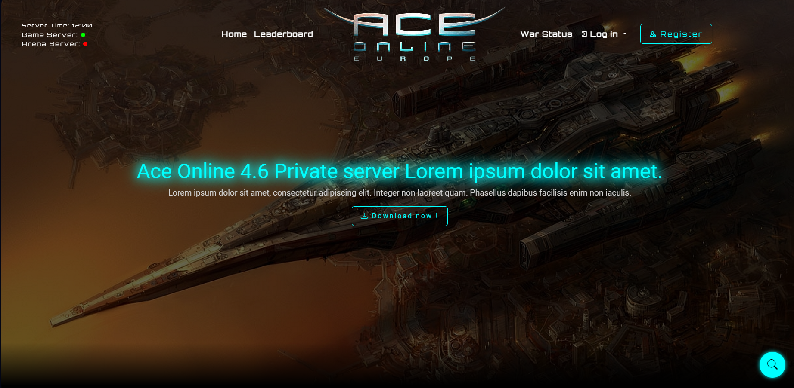
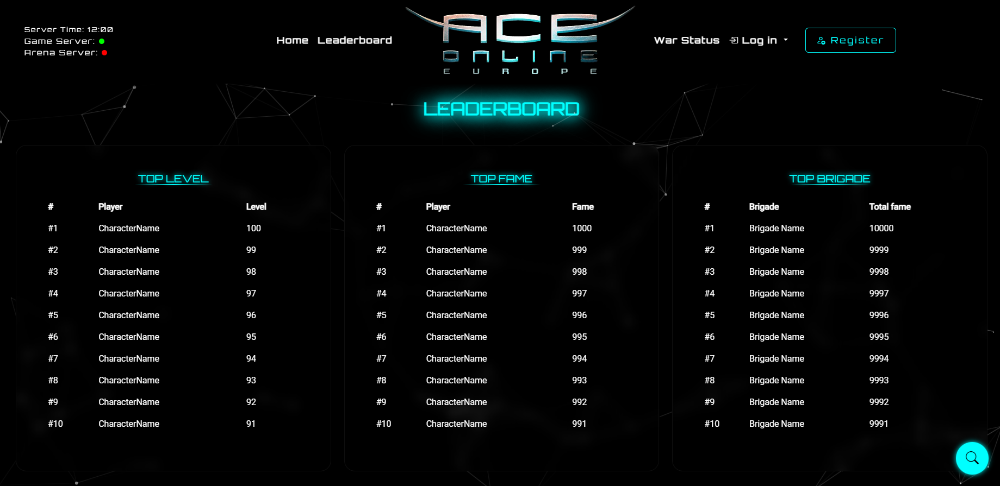
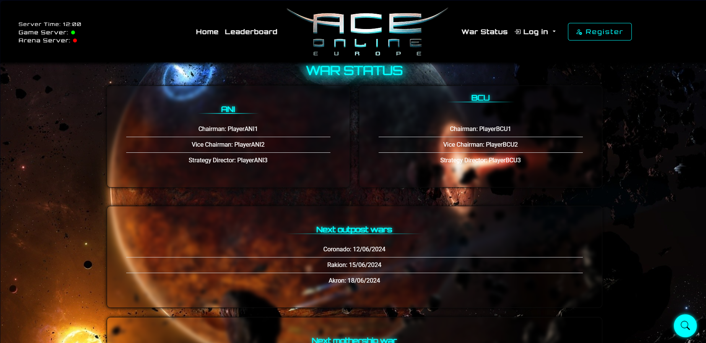
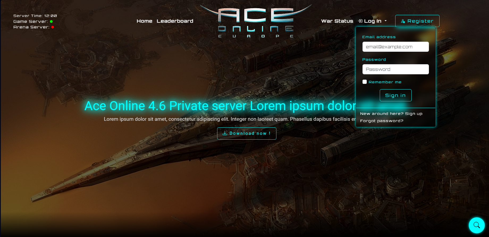
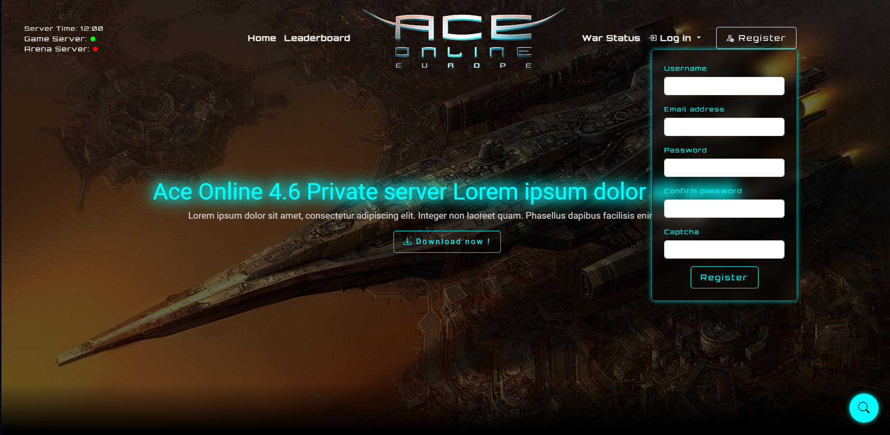
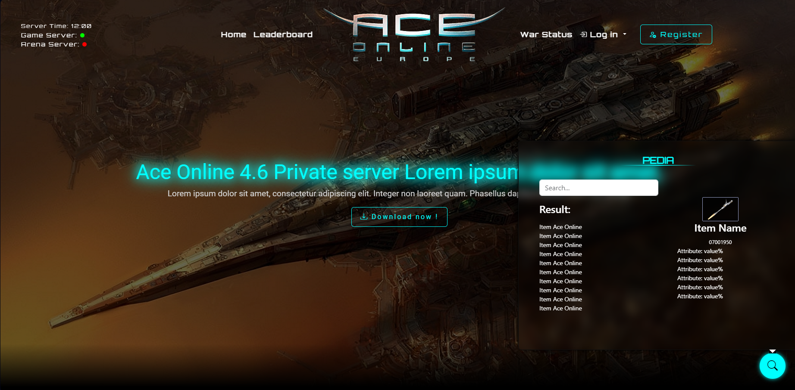

# Ace Online Private Servers free website template

## Description

This project is a free template for Ace Online private servers. It includes components such as a leaderboard, war status, login and registration forms, and a pedia form.

The template is almost responsive, except for the pedia pop-up

**Please note that this is a template and there is no backend with it. I may release a simple API for the Pedia, and other AO's stuff here in the future.**
## Libs Used

- Bootstrap 5
- Particle.js

## Screenshots

